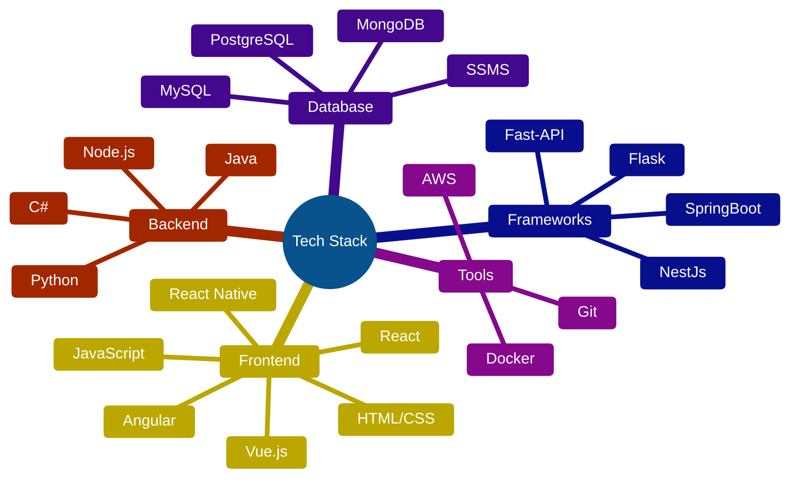
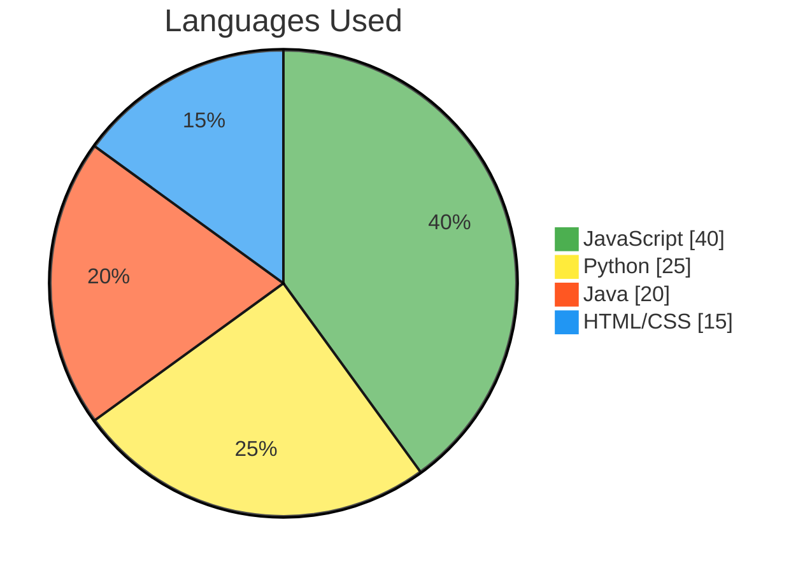
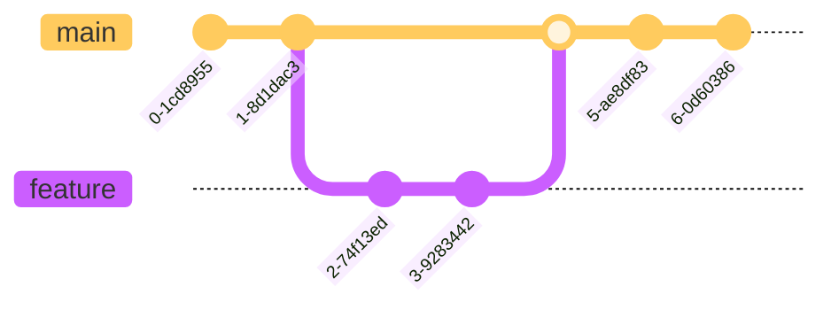

# Uditha Nayanajith

<div align="center">
  
  

  [](https://github.com/udithanayanajith)
  [](https://www.linkedin.com/in/uditha-nayanagith-a06a1a17b/)
  [](mailto:udithanayanajith97@gmail.com)
  
  
</div>

## 👨‍💻 About Me

```typescript
const UdithaNayanajith = {
    location: "Sri Lanka 🇱🇰",
    education: "BSc in Computer Science and Software Engineering",
    roles: ["Full Stack Developer", "Open Source Contributor", "Tech Enthusiast", "Provide AI/Ml Solutions"],
    currentFocus: ["Web Development", "Cloud Computing", "Machine Learning"],
    communities: {
        member: ["Developer Community Sri Lanka", "Open Source Contributors"]
    },
    lifePhilosophy: "Code, Learn, and Share 🚀"
};

```
[](https://www.linkedin.com/in/uditha-nayanagith-a06a1a17b/)
[](https://github.com/udithanayanajith)

## 👨‍💻 About Me

Full Stack Developer passionate about creating innovative solutions and learning new technologies. I specialize in web development and enjoy working on challenging projects that push my boundaries.

## 🚀 Skills & Technologies




## 📊 GitHub Statistics

[](https://git.io/streak-stats)



## 🌟 Featured Projects

### Project 1: E-Commerce Platform
- Full-stack application built with MERN stack
- Implemented secure payment gateway
- Responsive design with material-UI
- **Tech Stack**: MongoDB, Express.js, React, Node.js

### Project 2: Task Management System
- Real-time updates using WebSocket
- User authentication and authorization
- Drag-and-drop interface
- **Tech Stack**: Angular, Firebase, Node.js

## 📈 Contribution Graph



## 🎯 Current Focus

- Deep learning in AI/ML
- Cloud architecture
- Mobile app development
- System design patterns

## 📫 Get in Touch

- 📧 Email: udithanayanajith97@gmail.com
- 💼 LinkedIn: [Uditha Nayanajith](https://www.linkedin.com/in/uditha-nayanagith-a06a1a17b/)
- 🌐 Portfolio: [website.com](https://your-portfolio.com)

## 🏆 Achievements

- 🥇 HackerRank Problem Solving (Gold)
- 🎓 AWS Certified Developer


---
<div style="background-color: #0D1117; color: #c9d1d9; padding: 20px;">
    <i>"Code is like humor. When you have to explain it, it's bad." – Cory House</i>
</div>


