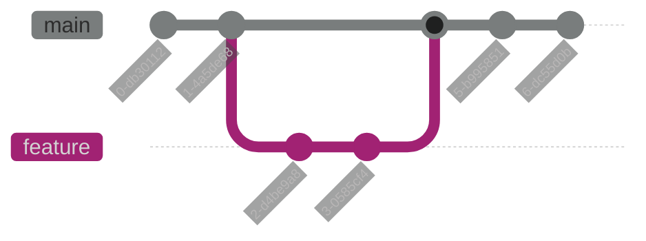

# 👋 Hi, I'm Uditha Nayanajith

[](https://www.linkedin.com/in/uditha-nayanagith-a06a1a17b/)
[](https://github.com/udithanayanajith)

## 👨‍💻 About Me

Full Stack Developer passionate about creating innovative solutions and learning new technologies. I specialize in web development and enjoy working on challenging projects that push my boundaries.

## 🚀 Skills & Technologies

```mermaid
%%{init: {'theme': 'base', 'themeVariables': { 'fontSize': '16px', 'primaryColor': '#4CAF50', 'secondaryColor': '#FFEB3B', 'tertiaryColor': '#FF5722', 'edgeLabelBackground': '#ffffff', 'primaryTextColor': '#FFFFFF', 'secondaryTextColor': '#000000', 'tertiaryTextColor': '#FFFFFF', 'nodeBorder': '2px solid #FFEB3B', 'nodeTextColor': '#FFFFFF', 'linkColor': '#2196F3'}}}%%
mindmap
 root((Tech Stack)) ::: style root fill:#00BCD4,stroke:#FFFFFF,color:#FFFFFF

    Frontend
      HTML/CSS
      JavaScript
      React
      Angular
    Backend
      Node.js
      Python
      Java
    Database
      MongoDB
      MySQL
      PostgreSQL
    Tools
      Git
      Docker
      AWS

```


## 📊 GitHub Statistics

[](https://git.io/streak-stats)


## 🌟 Featured Projects

### Project 1: E-Commerce Platform
- Full-stack application built with MERN stack
- Implemented secure payment gateway
- Responsive design with material-UI
- **Tech Stack**: MongoDB, Express.js, React, Node.js

### Project 2: Task Management System
- Real-time updates using WebSocket
- User authentication and authorization
- Drag-and-drop interface
- **Tech Stack**: Angular, Firebase, Node.js

## 📈 Contribution Graph



## 🎯 Current Focus

- Deep learning in AI/ML
- Cloud architecture
- Mobile app development
- System design patterns

## 📫 Get in Touch

- 📧 Email: your.email@example.com
- 💼 LinkedIn: [Uditha Nayanajith](https://www.linkedin.com/in/uditha-nayanajith)
- 🌐 Portfolio: [website.com](https://your-portfolio.com)

## 🏆 Achievements

- 🥇 HackerRank Problem Solving (Gold)
- 🎓 AWS Certified Developer
- 🏆 Best Innovation Award - University Project Exhibition

---
<div style="background-color: #0D1117; color: #c9d1d9; padding: 20px;">
    <i>"Code is like humor. When you have to explain it, it's bad." – Cory House</i>
</div>


